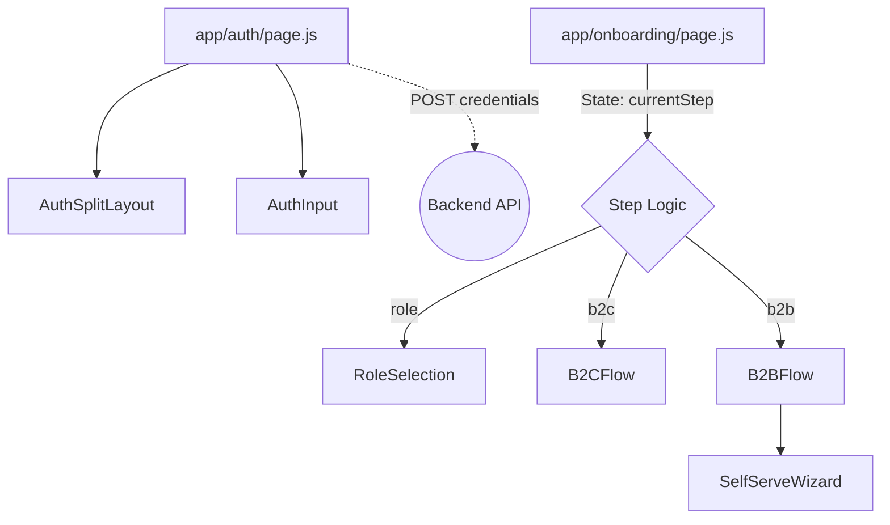

# GrowthOS Frontend

Central technical documentation for the GrowthOS frontend application built with Next.js.

## Architecture & Data Flow

The frontend currently uses a feature-based architecture utilizing the Next.js `app` router.

### Component Data Flow Rules
- Components explicitly document props received (and from where) and props passed (and to where).
- `app/auth/page.js` acts as the central state machine for the authentication flow, maintaining UI control over tabs and auth methods.
- `app/onboarding/page.js` acts as the central state machine for the onboarding flow.

## Guidelines
See `AI_GUIDELINES.md` for AI and developer contribution rules. Check `CHANGES_TIMELINE.md` for a historical log of implementations.
